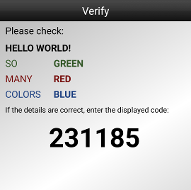

Caurus
======

[](https://pypi.org/project/caurus/)


**Caurus** is an open implementation of a verification scheme based on 2D barcodes.


Getting Started
---------------

Install and setup Caurus:
```bash
$ pip install caurus
$ caurus server init
```

Each device needs to be activated first. In our case, we assign the (arbitrary) ID 1 and set a SVG viewer (e.g. a browser) to automatically display the barcodes:
```
$ caurus server activate --viewer firefox 1
```
To complete the activation, add the displayed keys to `caurus.cfg`.

Afterwards, your are ready to verify arbitrary messages. There is support for lines, key-value pairs and some basic styling:
```
$ caurus server transaction 1 "Hello World!" "so:red:R" "many:blue:B" "colors:green:G"
Barcode: ...
Code: 231185
```



Documentation
-------------
→ [docs/](./docs/index.md)


Disclaimer
----------
This project is not affiliated, associated, authorized, endorsed by, or in any way officially connected with Cronto Ltd, OneSpan Inc, or any of their subsidiaries or affiliates.
