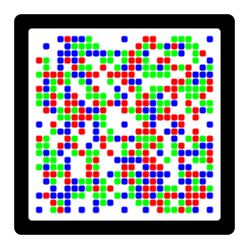

Caurus
======

**Caurus** is an open implementation of a verification scheme based on 2D barcodes.

Disclaimer
----------
This project is not affiliated, associated, authorized, endorsed by, or in any way officially connected with Cronto Ltd, OneSpan Inc, or any of their subsidiaries or affiliates.
