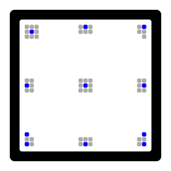

Caurus Documentation
====================

Barcode
-------

### Payload
| Element        |          Length |
| -------------- | ---------------:|
| Header         |         44 bits |
| MAC (SHA-256)  |         64 bits |
| AES-CTR nonce  |        128 bits |
| Encrypted data | depends on size |
| Checksum       |         24 bits |

### Encoding
To improve the chances of decoding barcodes successfully, Reed–Solomon error codes are used. After appending the error correction data, blocks of 142 bytes are obtained. These blocks get interleaved byte per byte. During the final step, the bytes are split in 4 2-bit components which are arranged on a grid in a column-major order.

### Alignment Patterns

